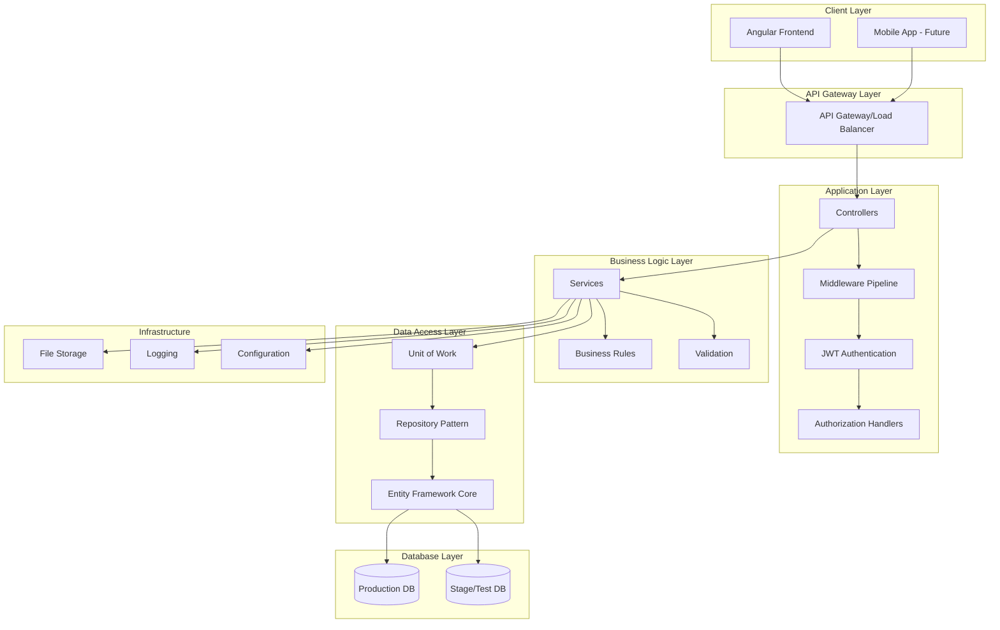
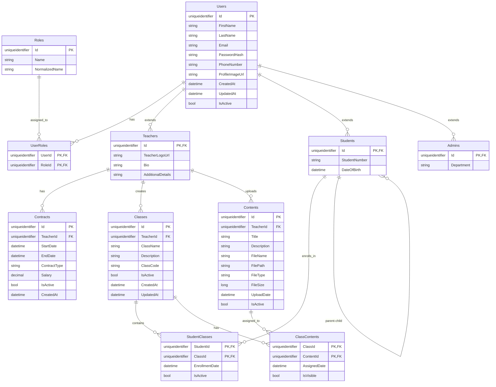
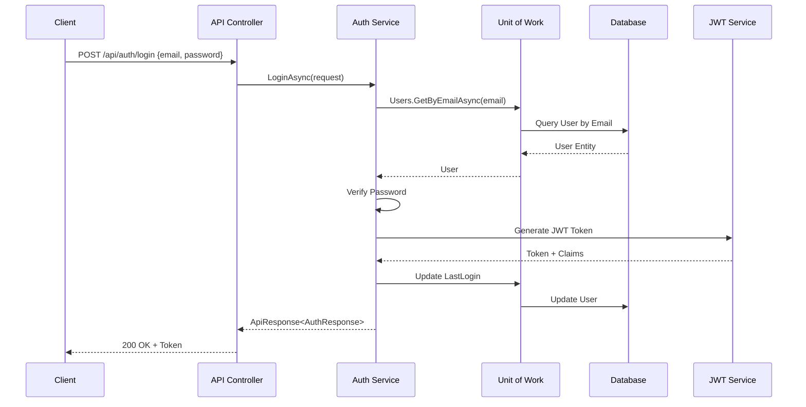
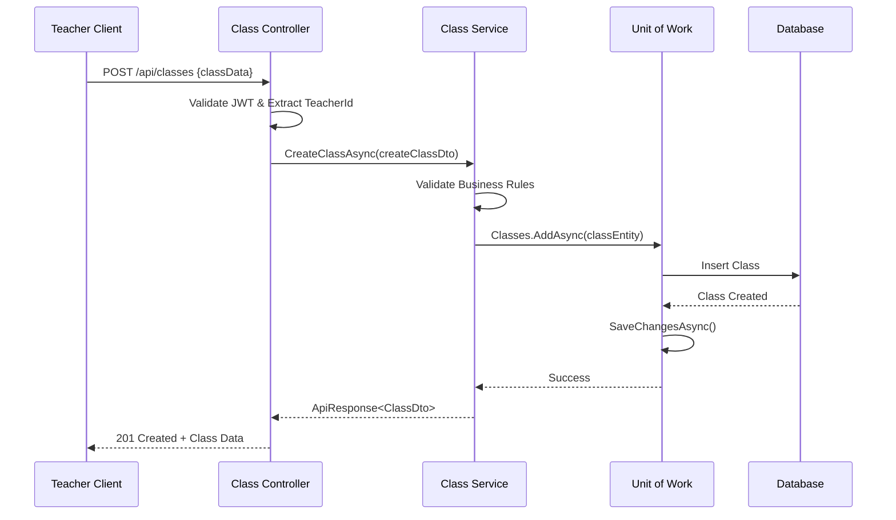
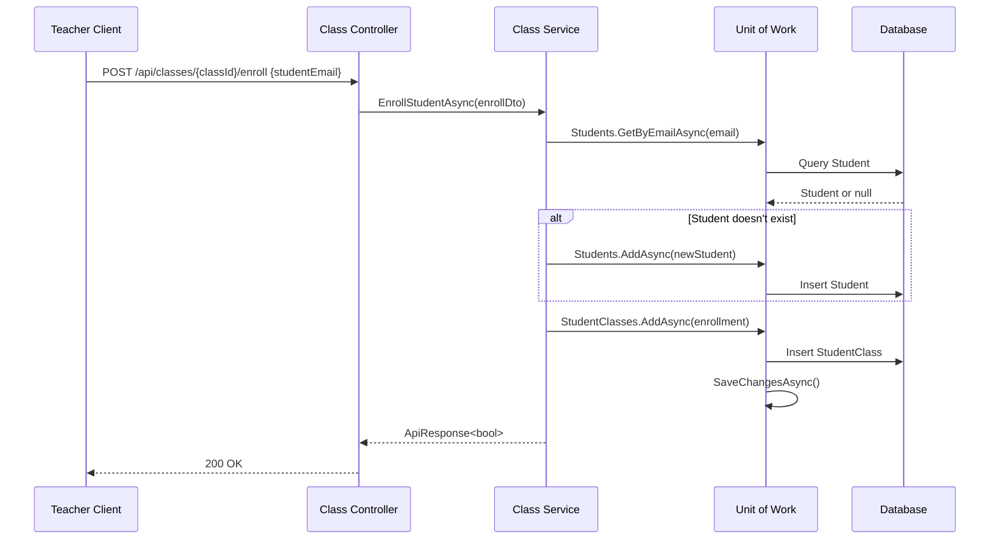
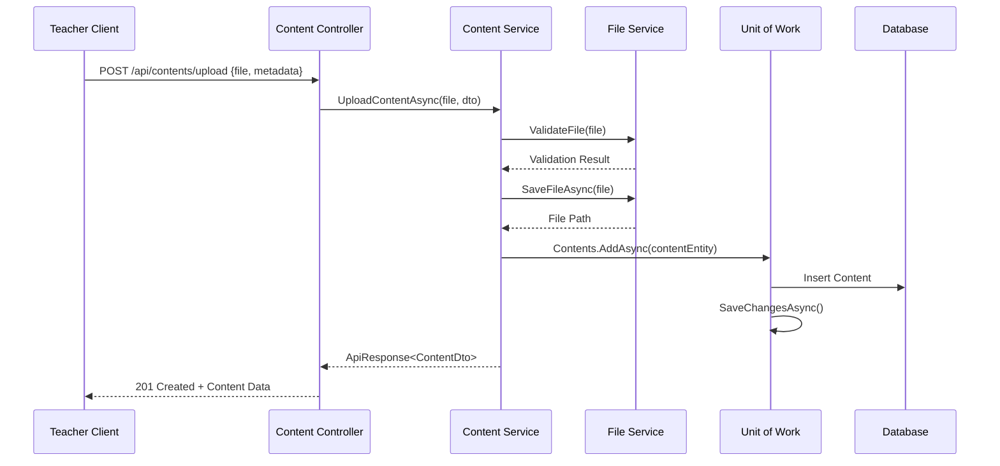

# eLearning Management System - Backend Documentation V1

## Table of Contents
1. [High Level Design (HLD)](#high-level-design-hld)
2. [Entity Relationship Diagram (ERD)](#entity-relationship-diagram-erd)
3. [Class Diagrams](#class-diagrams)
4. [Sequence Diagrams](#sequence-diagrams)
5. [API Response Models](#api-response-models)
6. [Architecture Implementation](#architecture-implementation)
7. [Database Schema](#database-schema)

---

## High Level Design (HLD)

### System Architecture Overview



### Technology Stack
- **Backend Framework**: .NET 8
- **Authentication**: ASP.NET Core Identity + JWT
- **Database**: SQL Server
- **ORM**: Entity Framework Core
- **Architecture Pattern**: Clean Architecture
- **Design Patterns**: Repository, Unit of Work, CQRS (Future)

---

## Entity Relationship Diagram (ERD)



---

## Class Diagrams

### Domain Models

```mermaid
classDiagram
    class BaseEntity {
        +Guid Id
        +DateTime CreatedAt
        +DateTime UpdatedAt
        +bool IsActive
    }

    class User {
        +string FirstName
        +string LastName
        +string Email
        +string PhoneNumber
        +string ProfileImageUrl
        +List~UserRole~ UserRoles
    }

    class Teacher {
        +string TeacherLogoUrl
        +string Bio
        +string AdditionalDetails
        +List~Contract~ Contracts
        +List~Class~ Classes
        +List~Content~ Contents
    }

    class Student {
        +string StudentNumber
        +DateTime DateOfBirth
        +List~StudentClass~ StudentClasses
    }

    class Admin {
        +string Department
    }

    class Contract {
        +Guid TeacherId
        +DateTime StartDate
        +DateTime EndDate
        +string ContractType
        +decimal Salary
        +Teacher Teacher
    }

    class Class {
        +Guid TeacherId
        +string ClassName
        +string Description
        +string ClassCode
        +Teacher Teacher
        +List~StudentClass~ StudentClasses
        +List~ClassContent~ ClassContents
    }

    class Content {
        +Guid TeacherId
        +string Title
        +string Description
        +string FileName
        +string FilePath
        +string FileType
        +long FileSize
        +DateTime UploadDate
        +Teacher Teacher
        +List~ClassContent~ ClassContents
    }

    BaseEntity <|-- User
    User <|-- Teacher
    User <|-- Student
    User <|-- Admin
    BaseEntity <|-- Contract
    BaseEntity <|-- Class
    BaseEntity <|-- Content

    Teacher ||--o{ Contract
    Teacher ||--o{ Class
    Teacher ||--o{ Content
    Class ||--o{ StudentClass
    Student ||--o{ StudentClass
    Class ||--o{ ClassContent
    Content ||--o{ ClassContent
```

### Service Layer Architecture

```mermaid
classDiagram
    class IBaseService~T~ {
        <<interface>>
        +Task~ApiResponse~T~~ GetByIdAsync(Guid id)
        +Task~ApiResponse~PaginatedResponse~T~~~ GetAllAsync(PaginationParameters parameters)
        +Task~ApiResponse~T~~ CreateAsync(T entity)
        +Task~ApiResponse~T~~ UpdateAsync(T entity)
        +Task~ApiResponse~bool~~ DeleteAsync(Guid id)
    }

    class BaseService~T~ {
        #IUnitOfWork unitOfWork
        #IMapper mapper
        +Task~ApiResponse~T~~ GetByIdAsync(Guid id)
        +Task~ApiResponse~PaginatedResponse~T~~~ GetAllAsync(PaginationParameters parameters)
        +Task~ApiResponse~T~~ CreateAsync(T entity)
        +Task~ApiResponse~T~~ UpdateAsync(T entity)
        +Task~ApiResponse~bool~~ DeleteAsync(Guid id)
    }

    class IAuthService {
        <<interface>>
        +Task~ApiResponse~AuthResponse~~ LoginAsync(LoginRequest request)
        +Task~ApiResponse~AuthResponse~~ RegisterAsync(RegisterRequest request)
        +Task~ApiResponse~bool~~ LogoutAsync(string userId)
        +Task~ApiResponse~bool~~ ChangePasswordAsync(ChangePasswordRequest request)
    }

    class ITeacherService {
        <<interface>>
        +Task~ApiResponse~TeacherDto~~ CreateTeacherAsync(CreateTeacherDto dto)
        +Task~ApiResponse~PaginatedResponse~TeacherDto~~~ GetTeachersAsync(PaginationParameters parameters)
        +Task~ApiResponse~bool~~ UpdateProfileAsync(UpdateTeacherProfileDto dto)
    }

    class IClassService {
        <<interface>>
        +Task~ApiResponse~ClassDto~~ CreateClassAsync(CreateClassDto dto)
        +Task~ApiResponse~PaginatedResponse~ClassDto~~~ GetTeacherClassesAsync(Guid teacherId, PaginationParameters parameters)
        +Task~ApiResponse~bool~~ EnrollStudentAsync(EnrollStudentDto dto)
    }

    IBaseService <|-- BaseService
    BaseService <|-- AuthService
    BaseService <|-- TeacherService
    BaseService <|-- ClassService
    IAuthService <|-- AuthService
    ITeacherService <|-- TeacherService
    IClassService <|-- ClassService
```



---

## Sequence Diagrams

### 1. User Authentication Flow



### 2. Teacher Creates Class Flow



### 3. Student Enrollment Flow



### 4. File Upload Flow



---

## API Response Models

### Base Response Models

```csharp
// Base API Response
public class ApiResponse<T>
{
    public string Message { get; set; }
    public T Data { get; set; }
    public bool Success { get; set; }
    public List<string> Errors { get; set; } = new();

    public static ApiResponse<T> SuccessResult(T data, string message = "Operation successful")
    {
        return new ApiResponse<T>
        {
            Success = true,
            Data = data,
            Message = message
        };
    }

    public static ApiResponse<T> FailureResult(string message, List<string> errors = null)
    {
        return new ApiResponse<T>
        {
            Success = false,
            Message = message,
            Errors = errors ?? new List<string>()
        };
    }
}

// Pagination Settings
public class PaginationSettings
{
    public int TotalCount { get; set; }
    public int CurrentPage { get; set; }
    public int PageSize { get; set; }
    public int TotalPages => (int)Math.Ceiling((double)TotalCount / PageSize);
    public bool HasNextPage => CurrentPage < TotalPages;
    public bool HasPreviousPage => CurrentPage > 1;
}

// Paginated Response
public class PaginatedResponse<T>
{
    public List<T> Data { get; set; }
    public PaginationSettings Settings { get; set; }
}

// Pagination Parameters
public class PaginationParameters
{
    public int Page { get; set; } = 1;
    public int Size { get; set; } = 10;
    public string SearchTerm { get; set; }
    public string SortBy { get; set; }
    public bool SortDescending { get; set; } = false;
}
```

### Authentication Models

```csharp
public class LoginRequest
{
    public string Email { get; set; }
    public string Password { get; set; }
}

public class RegisterRequest
{
    public string FirstName { get; set; }
    public string LastName { get; set; }
    public string Email { get; set; }
    public string Password { get; set; }
    public string PhoneNumber { get; set; }
    public string Role { get; set; }
}

public class AuthResponse
{
    public string Token { get; set; }
    public DateTime Expiration { get; set; }
    public UserDto User { get; set; }
    public List<string> Roles { get; set; }
}

public class ChangePasswordRequest
{
    public string CurrentPassword { get; set; }
    public string NewPassword { get; set; }
}
```

### DTOs (Data Transfer Objects)

```csharp
public class UserDto
{
    public Guid Id { get; set; }
    public string FirstName { get; set; }
    public string LastName { get; set; }
    public string Email { get; set; }
    public string PhoneNumber { get; set; }
    public string ProfileImageUrl { get; set; }
    public List<string> Roles { get; set; }
}

public class TeacherDto : UserDto
{
    public string TeacherLogoUrl { get; set; }
    public string Bio { get; set; }
    public string AdditionalDetails { get; set; }
    public List<ContractDto> Contracts { get; set; }
}

public class CreateTeacherDto
{
    public string FirstName { get; set; }
    public string LastName { get; set; }
    public string Email { get; set; }
    public string PhoneNumber { get; set; }
    public string Bio { get; set; }
    public string AdditionalDetails { get; set; }
}

public class ClassDto
{
    public Guid Id { get; set; }
    public string ClassName { get; set; }
    public string Description { get; set; }
    public string ClassCode { get; set; }
    public bool IsActive { get; set; }
    public DateTime CreatedAt { get; set; }
    public int StudentCount { get; set; }
    public int ContentCount { get; set; }
}

public class CreateClassDto
{
    public string ClassName { get; set; }
    public string Description { get; set; }
}

public class ContentDto
{
    public Guid Id { get; set; }
    public string Title { get; set; }
    public string Description { get; set; }
    public string FileName { get; set; }
    public string FileType { get; set; }
    public long FileSize { get; set; }
    public DateTime UploadDate { get; set; }
    public string DownloadUrl { get; set; }
}
```

---

## Architecture Implementation

### 1. Repository Pattern

```csharp
public interface IBaseRepository<T> where T : BaseEntity
{
    Task<T> GetByIdAsync(Guid id);
    Task<IEnumerable<T>> GetAllAsync();
    Task<PaginatedList<T>> GetPagedAsync(PaginationParameters parameters);
    Task<T> AddAsync(T entity);
    Task<T> UpdateAsync(T entity);
    Task<bool> DeleteAsync(Guid id);
    Task<bool> ExistsAsync(Guid id);
}

public class BaseRepository<T> : IBaseRepository<T> where T : BaseEntity
{
    protected readonly ApplicationDbContext _context;
    protected readonly DbSet<T> _dbSet;

    public BaseRepository(ApplicationDbContext context)
    {
        _context = context;
        _dbSet = context.Set<T>();
    }

    public virtual async Task<T> GetByIdAsync(Guid id)
    {
        return await _dbSet.FindAsync(id);
    }

    public virtual async Task<PaginatedList<T>> GetPagedAsync(PaginationParameters parameters)
    {
        var query = _dbSet.Where(x => x.IsActive);

        if (!string.IsNullOrEmpty(parameters.SearchTerm))
        {
            // Implement search logic based on entity type
        }

        var totalCount = await query.CountAsync();

        var items = await query
            .Skip((parameters.Page - 1) * parameters.Size)
            .Take(parameters.Size)
            .ToListAsync();

        return new PaginatedList<T>(items, totalCount, parameters.Page, parameters.Size);
    }

    // Other methods implementation...
}
```

### 2. Unit of Work Pattern

```csharp
public interface IUnitOfWork : IDisposable
{
    IUserRepository Users { get; }
    ITeacherRepository Teachers { get; }
    IStudentRepository Students { get; }
    IClassRepository Classes { get; }
    IContentRepository Contents { get; }

    Task<int> SaveChangesAsync();
    Task BeginTransactionAsync();
    Task CommitTransactionAsync();
    Task RollbackTransactionAsync();
}

public class UnitOfWork : IUnitOfWork
{
    private readonly ApplicationDbContext _context;
    private IDbContextTransaction _transaction;

    public UnitOfWork(ApplicationDbContext context)
    {
        _context = context;
        Users = new UserRepository(_context);
        Teachers = new TeacherRepository(_context);
        Students = new StudentRepository(_context);
        Classes = new ClassRepository(_context);
        Contents = new ContentRepository(_context);
    }

    public IUserRepository Users { get; private set; }
    public ITeacherRepository Teachers { get; private set; }
    public IStudentRepository Students { get; private set; }
    public IClassRepository Classes { get; private set; }
    public IContentRepository Contents { get; private set; }

    public async Task<int> SaveChangesAsync()
    {
        return await _context.SaveChangesAsync();
    }

    // Transaction methods implementation...
}
```

### 3. JWT Configuration Extension

```csharp
public static class AuthenticationExtensions
{
    public static IServiceCollection AddJwtAuthentication(this IServiceCollection services, IConfiguration configuration)
    {
        var jwtSettings = configuration.GetSection("JwtSettings").Get<JwtSettings>();

        services.AddSingleton(jwtSettings);

        services.AddAuthentication(options =>
        {
            options.DefaultAuthenticateScheme = JwtBearerDefaults.AuthenticationScheme;
            options.DefaultChallengeScheme = JwtBearerDefaults.AuthenticationScheme;
        })
        .AddJwtBearer(options =>
        {
            options.TokenValidationParameters = new TokenValidationParameters
            {
                ValidateIssuer = true,
                ValidateAudience = true,
                ValidateLifetime = true,
                ValidateIssuerSigningKey = true,
                ValidIssuer = jwtSettings.Issuer,
                ValidAudience = jwtSettings.Audience,
                IssuerSigningKey = new SymmetricSecurityKey(Encoding.UTF8.GetBytes(jwtSettings.SecretKey)),
                ClockSkew = TimeSpan.Zero
            };
        });

        return services;
    }
}

public class JwtSettings
{
    public string SecretKey { get; set; }
    public string Issuer { get; set; }
    public string Audience { get; set; }
    public int ExpirationMinutes { get; set; }
}
```

### 4. Middleware Extensions

```csharp
public static class MiddlewareExtensions
{
    public static IApplicationBuilder UseCustomMiddleware(this IApplicationBuilder app)
    {
        app.UseMiddleware<ExceptionHandlingMiddleware>();
        app.UseMiddleware<RequestLoggingMiddleware>();
        return app;
    }
}

public class ExceptionHandlingMiddleware
{
    private readonly RequestDelegate _next;
    private readonly ILogger<ExceptionHandlingMiddleware> _logger;

    public ExceptionHandlingMiddleware(RequestDelegate next, ILogger<ExceptionHandlingMiddleware> logger)
    {
        _next = next;
        _logger = logger;
    }

    public async Task InvokeAsync(HttpContext context)
    {
        try
        {
            await _next(context);
        }
        catch (Exception ex)
        {
            _logger.LogError(ex, "An unhandled exception occurred");
            await HandleExceptionAsync(context, ex);
        }
    }

    private static async Task HandleExceptionAsync(HttpContext context, Exception exception)
    {
        var response = new ApiResponse<object>
        {
            Success = false,
            Message = "An error occurred while processing your request",
            Errors = new List<string> { exception.Message }
        };

        context.Response.ContentType = "application/json";
        context.Response.StatusCode = StatusCodes.Status500InternalServerError;

        await context.Response.WriteAsync(JsonSerializer.Serialize(response));
    }
}
```

---

## Database Schema

### Connection Strings Configuration

```json
{
  "ConnectionStrings": {
    "ProductionConnection": "Server=prod-server;Database=eLearningProd;Trusted_Connection=true;MultipleActiveResultSets=true",
    "StagingConnection": "Server=stage-server;Database=eLearningStage;Trusted_Connection=true;MultipleActiveResultSets=true"
  },
  "JwtSettings": {
    "SecretKey": "your-secret-key-here",
    "Issuer": "eLearningSystem",
    "Audience": "eLearningUsers",
    "ExpirationMinutes": 60
  }
}
```

### Entity Configurations

```csharp
public class UserConfiguration : IEntityTypeConfiguration<User>
{
    public void Configure(EntityTypeBuilder<User> builder)
    {
        builder.HasKey(u => u.Id);
        builder.Property(u => u.Email).IsRequired().HasMaxLength(256);
        builder.HasIndex(u => u.Email).IsUnique();
        builder.Property(u => u.FirstName).IsRequired().HasMaxLength(100);
        builder.Property(u => u.LastName).IsRequired().HasMaxLength(100);

        // Configure relationships
        builder.HasMany(u => u.UserRoles)
               .WithOne(ur => ur.User)
               .HasForeignKey(ur => ur.UserId);
    }
}

public class TeacherConfiguration : IEntityTypeConfiguration<Teacher>
{
    public void Configure(EntityTypeBuilder<Teacher> builder)
    {
        builder.HasBaseType<User>();

        builder.Property(t => t.Bio).HasMaxLength(1000);
        builder.Property(t => t.AdditionalDetails).HasMaxLength(2000);

        // Configure relationships
        builder.HasMany(t => t.Classes)
               .WithOne(c => c.Teacher)
               .HasForeignKey(c => c.TeacherId);

        builder.HasMany(t => t.Contents)
               .WithOne(c => c.Teacher)
               .HasForeignKey(c => c.TeacherId);
    }
}
```

This comprehensive documentation provides the foundation for your eLearning backend development team. The architecture follows clean architecture principles with proper separation of concerns, and all the patterns you requested (Unit of Work, Repository, JWT, pagination) are included with your specified response models.
