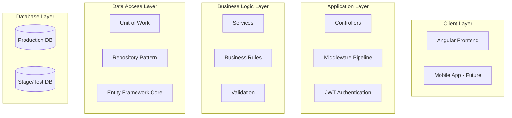

# eLearning Management System (LMS)

A comprehensive learning management platform built with .NET 8 and Angular 19, designed to facilitate seamless online education for teachers, students, and administrators.

---

## 📋 Project Overview

The eLearning Management System is a full-stack web application that provides a robust platform for managing online education. The system supports multiple user roles, content management, class administration, and progressive feature delivery across multiple versions.

**Key Features:**
- Secure authentication and role-based authorization
- Teacher and student management
- Content upload and assignment system
- Class creation and enrollment
- Cross-environment data migration
- Responsive web interface
- Clean architecture implementation

---

## 🎯 Business Goals

- **Streamline Education Management**: Provide teachers with intuitive tools to manage classes, students, and content
- **Enhance Learning Experience**: Enable students to easily access learning materials and track their progress
- **Ensure System Security**: Implement robust authentication and authorization mechanisms
- **Facilitate Testing**: Enable safe testing with separate production and staging environments
- **Support Scalability**: Design architecture to support future enhancements and mobile integration
- **Reduce Administrative Overhead**: Automate student enrollment and prevent data duplication

---

## 👥 Target Users

### **Primary Users**
- **Teachers**: Create classes, upload content, manage students, track performance
- **Students**: Access learning materials, view class information, track progress
- **Administrators**: Manage teacher accounts, contracts, and system configuration

### **Secondary Users**
- **Support Developers**: Test functionality in staging environment
- **Parents** *(V3)*: Monitor children's academic progress and performance

---

## 🛠️ Technology Stack

### **Backend**
- **.NET 8**: Web API framework
- **Entity Framework Core**: Object-relational mapping
- **SQL Server**: Primary database
- **ASP.NET Core Identity**: Authentication & authorization
- **JWT**: Token-based authentication
- **AutoMapper**: Object-to-object mapping

### **Frontend**
- **Angular 19**: Progressive web application framework
- **Angular Material**: UI component library
- **TypeScript**: Type-safe JavaScript
- **RxJS**: Reactive programming
- **SCSS**: Styling

### **Architecture & Patterns**
- **Clean Architecture**: Separation of concerns
- **Repository Pattern**: Data access abstraction
- **Unit of Work**: Transaction management
- **CQRS**: Command Query Responsibility Segregation *(planned)*
- **Dependency Injection**: Loose coupling

---

## 👥 User Roles & Permissions

| Role | Permissions |
|------|-------------|
| **Administrator** | • Create/manage teacher accounts<br>• Manage contracts and renewals<br>• Access production database<br>• Copy data between environments |
| **Support Developer** | • Full access to Stage/Test DB only<br>• Test all functionality<br>• No production data access |
| **Teacher** | • Manage personal profile<br>• Create and manage classes<br>• Upload and assign content<br>• Add/transfer students<br>• View analytics dashboard |
| **Student** | • Access assigned classes<br>• View and download content<br>• Track personal progress<br>• Update basic profile |

---

## 🚀 Development Roadmap

### **Version 1 (Core System)** - *Current Focus*
- ✅ User authentication & authorization
- ✅ Teacher and student management
- ✅ Class creation and enrollment
- ✅ Content upload and assignment
- ✅ Database environment separation

### **Version 2 (Learning Activities)**
- 🔄 Assignments with due dates
- 🔄 Quiz management system
- 🔄 Calendar/agenda integration
- 🔄 Enhanced analytics

### **Version 3 (Engagement & Parents)**
- 📱 Mobile application (iOS/Android)
- 👨‍👩‍👧‍👦 Parent portal integration
- 📹 Meeting integration
- 📊 QR code attendance

### **Version 4 (Cloud & Scalability)**
- ☁️ AWS S3 integration
- 🐳 Docker containerization
- 📈 Performance optimization
- 🔧 Advanced analytics

---

## 🏗️ System Design & Architecture

### **High-Level Architecture**



### **Low-Level Design (LLD)**

#### **Core Components**
- **Controllers**: Handle HTTP requests and responses
- **Services**: Business logic implementation
- **Repositories**: Data access abstraction
- **DTOs**: Data transfer between layers
- **Entities**: Domain models
- **Middleware**: Cross-cutting concerns (logging, exception handling)

#### **Key Design Patterns**
- **Repository Pattern**: Abstracts data access logic
- **Unit of Work**: Manages database transactions
- **Dependency Injection**: Promotes loose coupling
- **Factory Pattern**: Object creation abstraction

---

## 🏗️ Clean Architecture Implementation

### **Project Structure**
```
eLearning.API/              # Presentation Layer
├── Controllers/
├── Middleware/
├── Extensions/
└── Program.cs

eLearning.Application/      # Business Logic Layer
├── Services/
├── DTOs/
├── Interfaces/
└── Validators/

eLearning.Domain/          # Domain Layer
├── Entities/
├── Enums/
└── Constants/

eLearning.Infrastructure/  # Data Access Layer
├── Repositories/
├── Data/
├── Configurations/
└── Migrations/
```

### **Dependency Flow**
- **API** → **Application** → **Domain**
- **Application** → **Infrastructure** (via interfaces)
- **Infrastructure** → **Domain**

---

## Database Schema (Domain Entities)

### **Core Entities**

```csharp
// Base Entity
public abstract class BaseEntity
{
    public Guid Id { get; set; }
    public DateTime CreatedAt { get; set; }
    public DateTime UpdatedAt { get; set; }
    public bool IsActive { get; set; }
}

// User Hierarchy
public class User : BaseEntity
{
    public string FirstName { get; set; }
    public string LastName { get; set; }
    public string Email { get; set; }
    public string PhoneNumber { get; set; }
    public string ProfileImageUrl { get; set; }
    public List<UserRole> UserRoles { get; set; }
}

public class Teacher : User
{
    public string TeacherLogoUrl { get; set; }
    public string Bio { get; set; }
    public string AdditionalDetails { get; set; }
    public List<Contract> Contracts { get; set; }
    public List<Class> Classes { get; set; }
    public List<Content> Contents { get; set; }
}

public class Student : User
{
    public string StudentNumber { get; set; }
    public DateTime DateOfBirth { get; set; }
    public List<StudentClass> StudentClasses { get; set; }
}
```

### **Relationship Models**
- **Many-to-Many**: Students ↔ Classes (via StudentClasses)
- **One-to-Many**: Teachers → Classes, Teachers → Contents
- **Many-to-Many**: Classes ↔ Contents (via ClassContents)

---

## ⚙️ Non-Functional Requirements

### **Performance**
- **Response Time**: < 2 seconds for standard operations
- **Throughput**: Support 100+ concurrent users
- **Database**: Optimized queries with proper indexing

### **Security**
- **Authentication**: JWT token-based authentication
- **Authorization**: Role-based access control (RBAC)
- **Data Protection**: Encrypted sensitive data
- **File Upload**: Secure file validation and storage

### **Scalability**
- **Horizontal Scaling**: Support for load balancers
- **Database**: Connection pooling and optimization
- **Caching**: Implement caching strategies in V2+

### **Reliability**
- **Uptime**: 99.5% availability target
- **Error Handling**: Comprehensive exception handling
- **Logging**: Structured logging for troubleshooting

---

## 🚀 Getting Started

### **Prerequisites**
- .NET 8 SDK
- Node.js 18+ and npm
- SQL Server 2019+
- Visual Studio 2022 or VS Code

### **Backend Setup**
```bash
# Clone repository
git clone <repository-url>

# Navigate to API project
cd eLearning.API

# Restore packages
dotnet restore

# Update database with Identity tables
dotnet ef migrations add InitialIdentityMigration
dotnet ef database update

# Run application
dotnet run
```

### **Frontend Setup**
```bash
# Navigate to Angular project
cd eLearning.Frontend

# Install dependencies
npm install

# Start development server
ng serve
```

### **Configuration**
```json
{
  "ConnectionStrings": {
    "ProductionConnection": "Server=prod-server;Database=eLearningProd;...",
    "StagingConnection": "Server=stage-server;Database=eLearningStage;..."
  },
  "JwtSettings": {
    "SecretKey": "your-secret-key",
    "Issuer": "eLearningSystem",
    "Audience": "eLearningUsers",
    "ExpirationMinutes": 60
  }
}
```

---

## 📝 Development Guidelines

### **Code Standards**
- Follow C# coding conventions
- Use meaningful variable and method names
- Implement proper error handling
- Write unit tests for business logic
- Document public APIs

### **Git Workflow**
- Create feature branches from `develop`
- Use conventional commit messages
- Submit pull requests for code review
- Maintain linear commit history

### **Branch Strategy**
- `main`: Production-ready code
- `develop`: Integration branch
- `feature/*`: Feature development
- `hotfix/*`: Critical bug fixes

---

## API Guidelines

### **Response Format**
```csharp
public class ApiResponse<T>
{
    public string Message { get; set; }
    public T Data { get; set; }
    public bool Success { get; set; }
    public List<string> Errors { get; set; }
}
```

### **Endpoint Conventions**
- **GET** `/api/[controller]` - List resources
- **GET** `/api/[controller]/{id}` - Get specific resource
- **POST** `/api/[controller]` - Create resource
- **PUT** `/api/[controller]/{id}` - Update resource
- **DELETE** `/api/[controller]/{id}` - Delete resource

### **Authentication**
- Include JWT token in Authorization header
- Use Bearer token format: `Authorization: Bearer <token>`

---

## 🧪 Testing Strategy

### **Unit Testing**
- **Framework**: xUnit
- **Mocking**: Moq
- **Coverage Target**: >80%
- **Focus**: Business logic and services

### **Integration Testing**
- **Database Testing**: In-memory database for tests
- **API Testing**: Test controller endpoints
- **Authentication Testing**: JWT token validation

### **End-to-End Testing**
- **Framework**: Cypress (planned)
- **Scenarios**: Critical user paths
- **Environments**: Staging environment

---

## 📊 Monitoring & Analytics

### **Application Monitoring**
- **Logging**: Structured logging with Serilog
- **Metrics**: Performance counters
- **Health Checks**: Database and external service health

### **User Analytics** *(V2+)*
- **Dashboard Analytics**: User engagement metrics
- **Performance Tracking**: Student progress analytics
- **Usage Statistics**: Content access patterns

---

## 🔐 Security Considerations

### **Authentication & Authorization**
- JWT token expiration and refresh
- Role-based access control (RBAC)
- Secure password policies

### **Data Protection**
- Input validation and sanitization
- SQL injection prevention
- XSS protection
- HTTPS enforcement

### **File Upload Security**
- File type validation
- Size limitations
- Virus scanning *(V2+)*
- Secure file storage

---

## 📚 Documentation

### **API Documentation**
- Swagger/OpenAPI integration
- Endpoint documentation with examples
- Authentication requirements

### **Database Documentation**
- Entity relationship diagrams
- Table structure and constraints
- Migration scripts

### **User Guides**
- Teacher onboarding guide
- Student access instructions
- Administrator manual

---

## 🤝 Contributing

### **How to Contribute**
1. Fork the repository
2. Create a feature branch
3. Make your changes
4. Write/update tests
5. Submit a pull request

### **Code Review Process**
- All PRs require review approval
- Automated tests must pass
- Code coverage maintained
- Documentation updated

---

## 📞 Support

### **Development Team**
- **Backend Lead**: [Name] - backend@elearning.com
- **Frontend Lead**: [Name] - frontend@elearning.com
- **DevOps**: [Name] - devops@elearning.com

### **Issue Tracking**
- GitHub Issues for bug reports
- Feature requests via GitHub Discussions
- Security issues: security@elearning.com

---

## 📈 Success Metrics

### **Technical Metrics**
- **Performance**: API response times < 2s
- **Reliability**: 99.5% uptime
- **Security**: Zero critical vulnerabilities
- **Code Quality**: >80% test coverage

### **Business Metrics**
- **User Adoption**: Teacher/student registration rates
- **Engagement**: Content upload and access frequency
- **Satisfaction**: User feedback scores
- **Growth**: System usage trends

---

## 📄 License

This project is licensed under the [MIT License](LICENSE) - see the LICENSE file for details.

---

## 🔄 Version History

- **V1.0** *(Current)*: Core system with authentication and basic features
- **V2.0** *(Planned)*: Learning activities and enhanced analytics
- **V3.0** *(Planned)*: Mobile app and parent portal
- **V4.0** *(Planned)*: Cloud migration and scalability improvements

---

*Last updated: 5/9/2025 | Version: 1.0*
